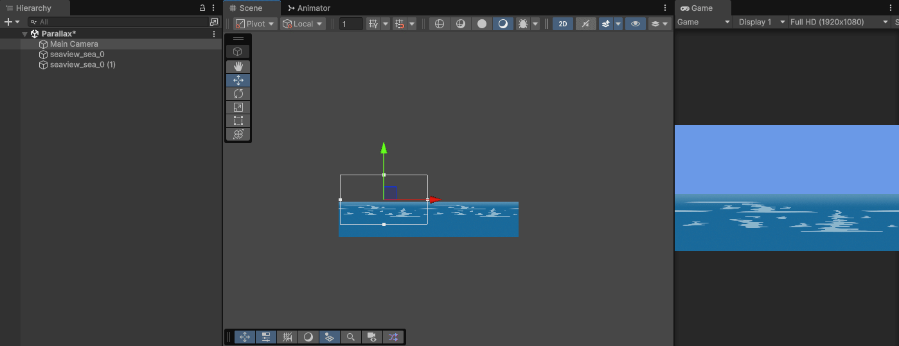
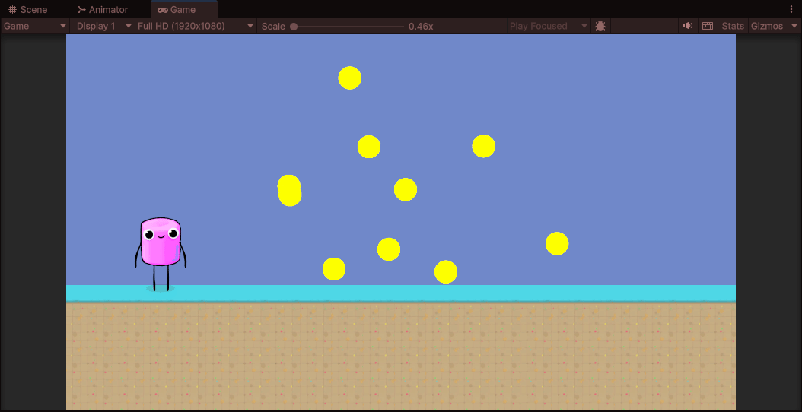

# Introducción a la programación de juegos 2D. Técnicas
## Ginés Cruz Chávez

1. La cámara está fija, el fondo se va desplazando en cada frame. Se usan dos fondos. Uno de ellos lo va viendo la cámara en todo momento, el otro está preparado para el momento en que se ha avanzado hasta el punto en el que la vista de la cámara ya no abarcaría el fondo inicial. Por tanto, se va actualizando en todo momento la posición de los dos fondos, haciéndolos avanzar hacia la izquierda. Cuando la cámara alcanza el límite, se debe intercambiar el rol de los fondos. Aplicar un fondo con scroll a tu escena utilizando la técnica descrita en a.

Script: [ScrollingBackgroundTeleport.cs](scripts/ScrollingBackgroundTeleport.cs)

2. La cámara se desplaza a la derecha y el fondo está estático. Existe nuevamente un fondo de reserva, que pasa a verse cuando el avance de la cámara sobrepasa el límite. El fondo anterior deb ubicarse a continuación del otro para que esté preparado. Aplicar un fondo con scroll a tu escena utilizando la técnica descrita en b.

Script: [ScrollingBackgroundTeleport.cs](scripts/ScrollingBackgroundTeleport.cs), [ScrollingCamera.cs](scripts/ScrollingCamera.cs)

3. Aplicar un fondo a tu escena aplicando la técnica del desplazamiento de textura.

Script: [ScrollingBackgroundMaterial.cs](scripts/ScrollingBackgroundMaterial.cs)

4. Aplicar efecto parallax usando la técnica de scroll en la que se mueve continuamente la posición del fondo.

Script: [ScrollingBackgroundTeleport.cs](scripts/ScrollingBackgroundTeleport.cs)

5. Aplicar efecto parallax actualizando el offset de la textura.

Script: [ScrollingBackgroundParallax.cs](scripts/ScrollingBackgroundParallax.cs)

6. En tu escena 2D crea un prefab que sirva de base para generar un tipo de objetos sobre los que vas a hacer un pooling de objetos que se recolectarán continuamente en tu escena. Cuando un objeto es recolectado debe pasar al pool y dejar de visualizarse. Este objeto estará disponible en el pool. Cada objeto debe llevar un contador, cuando alcance 3 será destruido. En la escena, siempre que sea posible debe haber una cantidad de objetos que fijes, hasta que el número de objetos que no se han eliminado sea menor que dicha cantidad. Recuerda que para generar los objetos puedes usar el método Instantiate. Los objetos ya creados pueden estar activos o no, para ello usar SetActive.

Scripts: [ObjectManager.cs](scripts/ObjectManager.cs), [ObjectPool.cs](scripts/ObjectPool.cs), [PoolableObject.cs](scripts/PoolableObject.cs)

7. Revisa tu código de la entrega anterior e indica las mejoras que podrías hacer de cara al rendimiento.

En el código de anteriores prácticas se ha procurado que el rendimiento sea el mejor posible utilizando las siguientes técnicas:

- Reducir el uso de GetComponent: Siempre que se utiliza un componente en Update, se almacena su referencia como miembro de la clase que se obtiene en Awake.
- Se utiliza CompareTag en vez del operador == para comparar la tag de un GameObject, evitando así copias innecesarias de cadenas.
- Se definen como Static aquellos objetos que no se moverán durante la partida.
- Como mejora posible, se puede utilizar StringBuilder para crear la cadena de puntuación que se muestra en la interfaz de usuario.